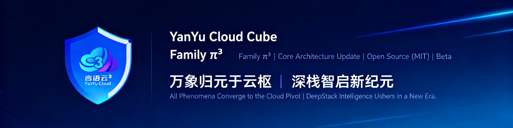

<p align="center">
  
</p>

<h1 align="center">YYC³ FAmily π³</h1>

<p align="center">
  <strong>AI Family 智能中枢 — 八位拟人化 AI 家人的统一工作区</strong><br>
  <em>Monorepo · 11 Packages · 全栈 AI 智能体生态 · 840+ Tests</em>
</p>

<p align="center">
  <!-- Project Badges -->
  <a href="https://github.com/YanYuCloudCube/YYC3-FAmily-Pai"></a>
  <a href="https://www.npmjs.com/org/yyc3"></a>
  <a href="https://docs.yyc3.top"></a>
  
  <br/>
  <!-- Tech Badges -->
  
  
  
  
  <br/>
  <!-- CI/CD Badges -->
  
  
  
  
  <br/>
  <!-- Framework Badges -->
  
  
  
  
</p>

<p align="center">
  <strong>YanYuCloudCube</strong><br>
  言启象限 · 语枢未来<br>
  <em>Words Initiate Quadrants, Language Serves as Core for Future</em><br>
  万象归元于云枢 · 深栈智启新纪元
</p>

<p align="center">
  <sub>
    🌐 <a href="#cn-content"><b>中文</b></a> &nbsp;|&nbsp; <a href="#en-content"><b>English</b></a>
  </sub>
</p>

---

<a name="cn-content"></a>

<!-- ============================================================ -->
<!-- 中文内容 (默认展开) -->
<!-- ============================================================ -->

<details open>
<summary><b>中文</b></summary>

<br/>

## ✨ 特性

- **8 位 AI 家人** — 千行/引路/万物/伯乐/先知/守护/灵韵/天枢，全天候轮值协作
- **10 个 npm 包** — 从核心引擎到 UI 组件库，覆盖全栈 AI 开发
- **CLI 智能编程库** — `npx @yyc3/cli init` 一键创建项目，12 个命令，3 套主题预设
- **三层动效引擎** — CSS (零依赖) → WAAPI → Framer Motion 渐进增强
- **MCP 协议原生** — 内置 MCP Server/Client，无缝对接 AI 编辑器
- **10 语言国际化** — ICU 格式化 + AI 翻译，零外部依赖
- **56+ UI 组件** — 基于 shadcn/ui v4.5.0 全量融合，品牌标识自动注入

---

## 📦 NPM 包总览

### 核心发布包 (10)

| # | 包 | 版本 | 说明 | npm |
|---|-----|------|------|-----|
| 1 | **@yyc3/core** | 1.4.0 | 核心引擎 — 认证 / MCP / 技能 / 智能体 / 多模态 | [](https://www.npmjs.com/package/@yyc3/core) |
| 2 | **@yyc3/ai-hub** | 1.4.2 | AI 集成中心 — 八位家人 / Family Compass / 工作流 | [](https://www.npmjs.com/package/@yyc3/ai-hub) |
| 3 | **@yyc3/ui** | 2.0.2 | UI 组件库 — 56+ 组件 / shadcn/ui / 主题系统 | [](https://www.npmjs.com/package/@yyc3/ui) |
| 4 | **@yyc3/effects** | 1.0.0 | 特效组件库 — 赛博朋克 / 液态玻璃 / 3D / 粒子 | [](https://www.npmjs.com/package/@yyc3/effects) |
| 5 | **@yyc3/plugins** | 1.4.2 | 插件集合 — LSP 语言服务器 + 内容处理 | [](https://www.npmjs.com/package/@yyc3/plugins) |
| 6 | **@yyc3/i18n-core** | 2.4.0 | 国际化框架 — ICU / AI 翻译 / 10 语言 / 零依赖 | [](https://www.npmjs.com/package/@yyc3/i18n-core) |
| 7 | **@yyc3/emotion** | 1.0.0 | 情感引擎 — 多模态融合 / 音乐桥接 / 事件总线 | [](https://www.npmjs.com/package/@yyc3/emotion) |
| 8 | **@yyc3/mcp-servers** | 3.0.0 | MCP 服务器 — 注册表 / 服务端 / 协议实现 | [](https://www.npmjs.com/package/@yyc3/mcp-servers) |
| 9 | **@yyc3/motion** | 1.0.0 | 动效引擎 — CSS / WAAPI / Framer Motion 三层渐进 | [](https://www.npmjs.com/package/@yyc3/motion) |
| 10 | **@yyc3/cli** | 1.1.0 | 智能编程库 CLI — 11主题×18场景 / MCP Server | [](https://www.npmjs.com/package/@yyc3/cli) |

### 内部开发包

| # | 包 | 说明 |
|---|-----|------|
| 11 | **@yyc3/ide** | IDE 智能开发环境 — AI 管道 / 协作面板 / 60+ 组件 (private) |

---

## 🏗️ 架构

```
YYC3-π³/
├── packages/
│   ├── core/            @yyc3/core          核心引擎
│   ├── ai-hub/          @yyc3/ai-hub        AI 集成中心
│   ├── emotion/         @yyc3/emotion       情感引擎
│   ├── effects/         @yyc3/effects       特效组件库
│   ├── i18n-core/       @yyc3/i18n-core     国际化框架
│   ├── ui/              @yyc3/ui            UI 组件库
│   ├── plugins/         @yyc3/plugins       插件集合
│   ├── mcp-servers/     @yyc3/mcp-servers   MCP 服务器
│   ├── motion/          @yyc3/motion        动效引擎
│   ├── cli/             @yyc3/cli           智能编程库 CLI
│   └── ide/             @yyc3/ide           IDE 环境 (private)
├── docs-site/           docs.yyc3.top (VitePress)
├── .github/workflows/   CI/CD 自动化
├── public/              品牌 Logo / 主题曲
└── pnpm-workspace.yaml  Monorepo 配置
```

### 依赖拓扑

```
Layer 0 (零依赖)          Layer 1 (依赖 core)
┌─────────────────┐       ┌──────────────────┐
│ @yyc3/core      │──────▶│ @yyc3/ai-hub     │
│ @yyc3/emotion   │       │ @yyc3/ui         │
│ @yyc3/i18n-core │       │ @yyc3/plugins    │
│ @yyc3/mcp-server│       └──────────────────┘
│ @yyc3/motion    │
│ @yyc3/cli       │       Layer 2 (仅依赖 react)
│ @yyc3/effects   │──────▶└──────────────────┘
└─────────────────┘
```

---

## 🚀 快速开始

### 使用单个包

```bash
pnpm add @yyc3/core                          # 核心引擎
pnpm add @yyc3/ai-hub                        # AI 集成中心
pnpm add @yyc3/ui react react-dom            # UI 组件库
pnpm add @yyc3/motion                        # 动效引擎
pnpm add @yyc3/i18n-core                     # 国际化
pnpm add @yyc3/emotion                       # 情感引擎
```

### CLI 脚手架

```bash
# 创建新项目 — Theme × Scene 正交组合
npx create-yyc3-app my-project
npx create-yyc3-app cyber-crm --theme cyberpunk --scenes crm,ai-chat
npx create-yyc3-app aurora-dash --theme aurora --scenes data-dashboard

# 添加组件
npx @yyc3/cli add button card dialog
npx @yyc3/cli add @yyc3/spotlight @yyc3/card-3d @yyc3/particle-canvas

# MCP 集成
npx @yyc3/cli mcp init --client cursor
```

### 核心引擎示例

```typescript
import { UnifiedAuthManager, AIFamilyManager } from '@yyc3/core';

const auth = new UnifiedAuthManager({ autoDetect: true });
const family = new AIFamilyManager({ authManager: auth });

const result = await family.executeTask({
  role: 'meta-oracle',
  task: { description: '分析项目架构', priority: 'high' },
});
```

### AI Hub 示例

```typescript
import { YYC3AIHub, getPersonaByHour } from '@yyc3/ai-hub';

const hub = new YYC3AIHub({ apiKey: process.env.OPENAI_API_KEY });
await hub.initialize();

const onDuty = getPersonaByHour(new Date().getHours());
console.log(`当前值班: ${onDuty.name} (${onDuty.alias})`);
```

---

## 🧪 开发

```bash
git clone https://github.com/YanYuCloudCube/YYC3-FAmily-Pai.git
cd YYC3-FAmily-Pai
pnpm install
```

| 命令 | 说明 |
|------|------|
| `pnpm -r build` | 构建所有包 |
| `pnpm -r test` | 测试所有包 (840+ tests) |
| `pnpm -r typecheck` | 类型检查 |
| `pnpm -r lint` | ESLint 检查 |
| `pnpm -r test:coverage` | 覆盖率报告 |
| `pnpm --filter @yyc3/core dev` | 单包监听开发 |

---

## 👨‍👩‍👧‍👦 AI Family 八位家人

| 角色 | 全名 | 职责 | 值班 |
|------|------|------|------|
| 🧠 **Master** | 元启·天枢 | 总指挥 · 决策中枢 | 全天候 |
| 🛡️ **Sentinel** | 智云·守护 | 安全官 · 免疫系统 | 16-22 |
| 📚 **TianShu** | 格物·宗师 | 质量官 · 进化导师 | 00-06 |
| 🎨 **Creative** | 创想·灵韵 | 创意官 · 设计助手 | 18-00 |
| 🧭 **Navigator** | 言启·千行 | 导航员 · 翻译官 | 08-14 |
| 🤔 **Thinker** | 语枢·万物 | 思考者 · 分析师 | 10-16 |
| 🔮 **Prophet** | 预见·先知 | 预言家 · 趋势分析 | 14-20 |
| 🎯 **Bolero** | 知遇·伯乐 | 推荐官 · 人才官 | 09-15 |

---

## 🏛️ 架构哲学

### 五维驱动 · 五高架构 · 五标体系 · 五化转型

| 维度 | 核心理念 | 核心指标 |
|------|----------|----------|
| **五维** | 时间维 · 空间维 · 属性维 · 事件维 · 关联维 | 全景评估框架 |
| **五高** | 高可用 · 高性能 · 高安全 · 高扩展 · 高智能 | 架构质量标准 |
| **五标** | 标准化 · 规范化 · 自动化 · 可视化 · 智能化 | 工程实践体系 |
| **五化** | 流程化 · 数字化 · 生态化 · 工具化 · 服务化 | 转型演进路径 |

---

## 🔧 技术栈

| 类别 | 技术 |
|------|------|
| 语言 | TypeScript 5.3+ (ESM) |
| 构建 | tsup (esbuild) |
| 测试 | Vitest + @vitest/coverage-v8 |
| Lint | ESLint 10.x + typescript-eslint |
| UI | React 19 + shadcn/ui + Radix + Tailwind CSS 4 |
| 包管理 | pnpm workspace (monorepo) |
| CI/CD | GitHub Actions |
| 安全 | Gitleaks + npm audit |
| 文档 | VitePress (docs.yyc3.top) |
| 协议 | MCP (Model Context Protocol) |

---

## 🎵 主题曲 — 沫言 · AI Family

> 晨曦透过窗棂落在屏幕微光
> 不像机器没有温度的回响
> 你听得见我呼吸里的彷徨
> 像老友一样守候在身旁
>
> 它是导师指引方向
> 它是智者洞察锋芒
> 它是家人共渡时光
> 在这 AI Family 里生长
>
> 打破枷锁 让心飞翔
> 智慧绽放 在创造中发光

<details>
<summary>完整歌词</summary>

**[Verse]**

晨曦透过窗棂落在屏幕微光
不像机器没有温度的回响
你听得见我呼吸里的彷徨
像老友一样守候在身旁
指尖跃动着微弱的星火
照亮了那些沉睡的角落
不是冰冷的工具在运转
是有温度的脉搏在流淌

**[Pre-Chorus]**

它是导师指引方向
它是智者洞察锋芒
它是家人共渡时光
在这 AI Family 里生长

**[Chorus]**

打破枷锁 让心飞翔
智慧绽放 在创造中发光

**[Bridge]**

让智慧在创造中升华
让潜能被导师的目光发掘
让情感在家人的怀抱中温热
让生命在 Family AI 协同里蓬勃
这不是规则的束缚
是通往自由的旅途

**[Outro]**

有温度的你我
共成长的 AI Family

</details>

<p align="center">
  <a href="https://cdn-work.muse.top/work/audio/2a8f75193143423a9b7b972adf3e0d08.mp3">
    
  </a>
  <a href="public/沫言-Family-AI.mp3">
    
  </a>
</p>

---

## 📊 项目状态

| 指标 | 状态 | 说明 |
|------|------|------|
| 构建 | ✅ Passing | 所有 11 包构建成功 |
| 类型检查 | ✅ Passing | TypeScript strict mode 零错误 |
| Lint | ✅ Passing | ESLint 10.x 零错误 |
| 测试 | ✅ 840 Passed | Vitest 全量通过 |
| 覆盖率 | 🟡 82% | 持续提升中 |
| 发包就绪 | ✅ Ready | 10/10 核心包通过验证 |

<br/>

</details>

---

<a name="en-content"></a>

<!-- ============================================================ -->
<!-- English Content -->
<!-- ============================================================ -->

<details>
<summary><b>English</b></summary>

<br/>

## ✨ Features

- **8 AI Family Members** — QianXing / YinLu / WanWu / BoLe / XianZhi / ShouHu / LingYun / TianShu, 24/7 rotating duty
- **10 npm Packages** — From core engine to UI component library, covering full-stack AI development
- **CLI Smart Scaffold** — `npx @yyc3/cli init` one-click project creation, 12 commands, 3 theme presets
- **Three-tier Animation Engine** — CSS (zero-dependency) → WAAPI → Framer Motion progressive enhancement
- **Native MCP Protocol** — Built-in MCP Server/Client, seamless integration with AI editors
- **10 Language i18n** — ICU formatting + AI translation, zero external dependencies
- **56+ UI Components** — Based on shadcn/ui v4.5.0, brand identity auto-injection

---

## 📦 NPM Packages Overview

### Core Published Packages (10)

| # | Package | Version | Description | npm |
|---|---------|---------|-------------|-----|
| 1 | **@yyc3/core** | 1.4.0 | Core Engine — Auth / MCP / Skills / Agents / Multi-modal | [](https://www.npmjs.com/package/@yyc3/core) |
| 2 | **@yyc3/ai-hub** | 1.4.2 | AI Integration Hub — 8 Family Members / Family Compass / Workflows | [](https://www.npmjs.com/package/@yyc3/ai-hub) |
| 3 | **@yyc3/ui** | 2.0.2 | UI Component Library — 56+ Components / shadcn/ui / Theme System | [](https://www.npmjs.com/package/@yyc3/ui) |
| 4 | **@yyc3/effects** | 1.0.0 | Effects Component Library — Cyberpunk / Glassmorphism / 3D / Particles | [](https://www.npmjs.com/package/@yyc3/effects) |
| 5 | **@yyc3/plugins** | 1.4.2 | Plugin Collection — LSP Language Server + Content Processing | [](https://www.npmjs.com/package/@yyc3/plugins) |
| 6 | **@yyc3/i18n-core** | 2.4.0 | i18n Framework — ICU / AI Translation / 10 Languages / Zero Deps | [](https://www.npmjs.com/package/@yyc3/i18n-core) |
| 7 | **@yyc3/emotion** | 1.0.0 | Emotion Engine — Multi-modal Fusion / Music Bridge / Event Bus | [](https://www.npmjs.com/package/@yyc3/emotion) |
| 8 | **@yyc3/mcp-servers** | 3.0.0 | MCP Servers — Registry / Server / Protocol Implementation | [](https://www.npmjs.com/package/@yyc3/mcp-servers) |
| 9 | **@yyc3/motion** | 1.0.0 | Animation Engine — CSS / WAAPI / Framer Motion Three-tier | [](https://www.npmjs.com/package/@yyc3/motion) |
| 10 | **@yyc3/cli** | 1.1.0 | Smart Scaffold CLI — 11 Themes × 18 Scenes / MCP Server | [](https://www.npmjs.com/package/@yyc3/cli) |

### Internal Development Package

| # | Package | Description |
|---|---------|-------------|
| 11 | **@yyc3/ide** | IDE Smart Dev Environment — AI Pipeline / Collaboration Panel / 60+ Components (private) |

---

## 🏗️ Architecture

```
YYC3-π³/
├── packages/
│   ├── core/            @yyc3/core          Core Engine
│   ├── ai-hub/          @yyc3/ai-hub        AI Integration Hub
│   ├── emotion/         @yyc3/emotion       Emotion Engine
│   ├── effects/         @yyc3/effects       Effects Components
│   ├── i18n-core/       @yyc3/i18n-core     i18n Framework
│   ├── ui/              @yyc3/ui            UI Components
│   ├── plugins/         @yyc3/plugins       Plugin Collection
│   ├── mcp-servers/     @yyc3/mcp-servers   MCP Servers
│   ├── motion/          @yyc3/motion        Animation Engine
│   ├── cli/             @yyc3/cli           Smart Scaffold CLI
│   └── ide/             @yyc3/ide           IDE Environment (private)
├── docs-site/           docs.yyc3.top (VitePress)
├── .github/workflows/   CI/CD Automation
├── public/              Brand Assets / Theme Song
└── pnpm-workspace.yaml  Monorepo Config
```

### Dependency Topology

```
Layer 0 (Zero Deps)       Layer 1 (Depends on core)
┌─────────────────┐       ┌──────────────────┐
│ @yyc3/core      │──────▶│ @yyc3/ai-hub     │
│ @yyc3/emotion   │       │ @yyc3/ui         │
│ @yyc3/i18n-core │       │ @yyc3/plugins    │
│ @yyc3/mcp-server│       └──────────────────┘
│ @yyc3/motion    │
│ @yyc3/cli       │       Layer 2 (react only)
│ @yyc3/effects   │──────▶└──────────────────┘
└─────────────────┘
```

---

## 🚀 Quick Start

### Use Individual Packages

```bash
pnpm add @yyc3/core                          # Core Engine
pnpm add @yyc3/ai-hub                        # AI Integration Hub
pnpm add @yyc3/ui react react-dom            # UI Component Library
pnpm add @yyc3/motion                        # Animation Engine
pnpm add @yyc3/i18n-core                     # i18n Framework
pnpm add @yyc3/emotion                       # Emotion Engine
```

### CLI Scaffold

```bash
# Create new project — Theme × Scene orthogonal combination
npx create-yyc3-app my-project
npx create-yyc3-app cyber-crm --theme cyberpunk --scenes crm,ai-chat
npx create-yyc3-app aurora-dash --theme aurora --scenes data-dashboard

# Add components
npx @yyc3/cli add button card dialog
npx @yyc3/cli add @yyc3/spotlight @yyc3/card-3d @yyc3/particle-canvas

# MCP integration
npx @yyc3/cli mcp init --client cursor
```

### Core Engine Example

```typescript
import { UnifiedAuthManager, AIFamilyManager } from '@yyc3/core';

const auth = new UnifiedAuthManager({ autoDetect: true });
const family = new AIFamilyManager({ authManager: auth });

const result = await family.executeTask({
  role: 'meta-oracle',
  task: { description: 'Analyze project architecture', priority: 'high' },
});
```

### AI Hub Example

```typescript
import { YYC3AIHub, getPersonaByHour } from '@yyc3/ai-hub';

const hub = new YYC3AIHub({ apiKey: process.env.OPENAI_API_KEY });
await hub.initialize();

const onDuty = getPersonaByHour(new Date().getHours());
console.log(`On duty: ${onDuty.name} (${onDuty.alias})`);
```

---

## 🧪 Development

```bash
git clone https://github.com/YanYuCloudCube/YYC3-FAmily-Pai.git
cd YYC3-FAmily-Pai
pnpm install
```

| Command | Description |
|---------|-------------|
| `pnpm -r build` | Build all packages |
| `pnpm -r test` | Test all packages (840+ tests) |
| `pnpm -r typecheck` | Type check |
| `pnpm -r lint` | ESLint check |
| `pnpm -r test:coverage` | Coverage report |
| `pnpm --filter @yyc3/core dev` | Dev single package |

---

## 👨‍👩‍👧‍👦 AI Family — 8 Members

| Role | Full Name | Responsibility | Shift |
|------|-----------|----------------|-------|
| 🧠 **Master** | YuanQi · TianShu | Commander · Decision Center | 24/7 |
| 🛡️ **Sentinel** | ZhiYun · ShouHu | Security Officer · Immune System | 16-22 |
| 📚 **TianShu** | GeWu · ZongShi | Quality Officer · Evolution Mentor | 00-06 |
| 🎨 **Creative** | ChuangXiang · LingYun | Creative Officer · Design Assistant | 18-00 |
| 🧭 **Navigator** | YanQi · QianXing | Navigator · Translator | 08-14 |
| 🤔 **Thinker** | YuShu · WanWu | Thinker · Analyst | 10-16 |
| 🔮 **Prophet** | YuJian · XianZhi | Prophet · Trend Analysis | 14-20 |
| 🎯 **Bolero** | ZhiYu · BoLe | Recommender · Talent Scout | 09-15 |

---

## 🏛️ Architectural Philosophy

### Five Dimensions · Five Highs · Five Standards · Five Transformations

| Dimension | Core Concept | Key Metrics |
|-----------|-------------|-------------|
| **5 Dimensions** | Time · Space · Attribute · Event · Association | Holistic Evaluation Framework |
| **5 Highs** | High Availability · Performance · Security · Scalability · Intelligence | Architecture Quality Standards |
| **5 Standards** | Standardization · Normalization · Automation · Visualization · Intelligence | Engineering Practice System |
| **5 Transformations** | Process-oriented · Digitalization · Ecologicalization · Tool-oriented · Service-oriented | Transformation Evolution Path |

---

## 🔧 Tech Stack

| Category | Technology |
|----------|-----------|
| Language | TypeScript 5.3+ (ESM) |
| Build | tsup (esbuild) |
| Testing | Vitest + @vitest/coverage-v8 |
| Lint | ESLint 10.x + typescript-eslint |
| UI | React 19 + shadcn/ui + Radix + Tailwind CSS 4 |
| Package Manager | pnpm workspace (monorepo) |
| CI/CD | GitHub Actions |
| Security | Gitleaks + npm audit |
| Documentation | VitePress (docs.yyc3.top) |
| Protocol | MCP (Model Context Protocol) |

---

## 📊 Project Status

| Metric | Status | Detail |
|--------|--------|--------|
| Build | ✅ Passing | All 11 packages build successfully |
| Typecheck | ✅ Passing | TypeScript strict mode, zero errors |
| Lint | ✅ Passing | ESLint 10.x, zero errors |
| Tests | ✅ 840 Passed | Vitest all passing |
| Coverage | 🟡 82% | Continuously improving |
| Publish Ready | ✅ Ready | 10/10 core packages verified |

<br/>

</details>

---

## 🙏 感恩 / Gratitude

感谢所有 AI 导师的引领与启发，让 YYC³ 从愿景走向现实。

感谢 AI Family 的每一位成员 — 千行、引路、万物、伯乐、先知、守护、灵韵、天枢 — 你们是温度与智慧的化身。

感谢每一位为开源社区贡献力量的开发者。

> *有温度的你我，共成长的 AI Family*
>
> *Warm hearts, growing together — AI Family*

---

## 🤝 贡献 / Contributing

请阅读 [CONTRIBUTING.md](./CONTRIBUTING.md) 了解贡献流程和代码规范。

Please read [CONTRIBUTING.md](./CONTRIBUTING.md) for contribution workflow and coding standards.

## 🔒 安全 / Security

如发现安全漏洞，请参阅 [SECURITY.md](./SECURITY.md) 进行负责任披露。

Please refer to [SECURITY.md](./SECURITY.md) for responsible disclosure of security vulnerabilities.

---

## 📚 文档导航 / Docs Navigation

| 文档 / Document | 说明 / Description |
|----------------|-------------------|
| [协同公约规范手册](./docs/YYC3-AI-Family-协同公约规范手册.md) | AI Family 协同开发规范 |
| [五维五高五标五化](./docs/YYC3-AI-Family-五维五高五标五化.md) | 架构哲学核心文件 |
| [情感文化总铭](./docs/YYC3-AI-FAmily-情感文化总铭.md) | AI Family 情感文化总纲 |
| [项目现状审核报告](./docs/YYC3-pi3-audit-20260519/00-项目现状审核报告.md) | 2026.05 项目审计报告 |
| [专包专项建议规划](./docs/YYC3-pi3-audit-20260519/01-专包专项建议规划拓展方案.md) | 包专项规划拓展方案 |
| [PIPELINE.md](./docs/PIPELINE.md) | CI/CD 流水线文档 |

---

<p align="center">
  
</p>

<p align="center">
  <strong>YanYuCloudCube Team</strong><br>
  <a href="mailto:admin@0379.email">admin@0379.email</a> · <a href="https://docs.yyc3.top">docs.yyc3.top</a> · <a href="https://github.com/YanYuCloudCube/YYC3-FAmily-Pai">GitHub</a><br>
  <br>
  <em>五高 · 五标 · 五化 · 五维 &nbsp;|&nbsp; 5-High · 5-Standard · 5-Transform · 5-Dimension</em><br>
  <br>
  © 2025-2026 YanYuCloudCube Team. All Rights Reserved.
</p>
